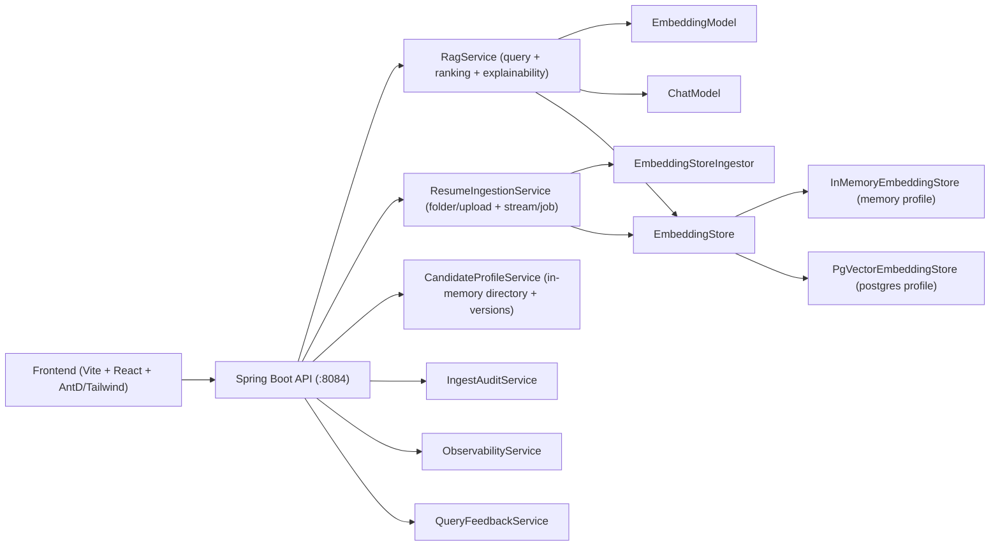
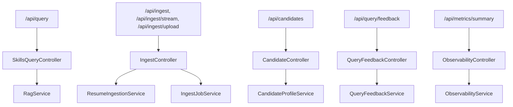

# System Architecture

## Runtime topology

## Primary backend modules

## Data planes

- Retrieval plane:
  - Segment embeddings are stored in `EmbeddingStore<TextSegment>`.
  - Query path performs vector retrieval, hybrid rescoring, deduplication, and answer generation.
- Candidate profile plane:
  - Candidate profile state is maintained in `CandidateProfileService` in memory.
  - Per-ingest snapshots are persisted as `CandidateProfileVersion` records inside the profile object.
  - Snapshot includes provenance fields (`extractionMethod`, normalized hash, confidence/evidence maps, warnings).

## Control/telemetry planes

- Ingest audit:
  - `IngestAuditService` captures per-run file events and run summaries.
- Metrics:
  - `ObservabilityService` tracks query/ingest counters and extraction quality counters.
- Feedback:
  - `QueryFeedbackService` stores answer feedback and recommends dynamic min-score thresholds.

## Deployment profiles

- `RAG_STORE=memory`:
  - Fast local iteration, non-persistent embeddings.
- `RAG_STORE=postgres`:
  - Persistent embeddings via pgvector, Flyway-managed schema.
