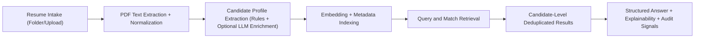
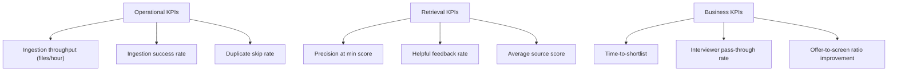

# Business Problem and Solution Strategy

## Executive summary

Resume RAG Studio solves a high-friction recruiting workflow: turning large volumes of inconsistent resumes into searchable, explainable, role-aligned candidate intelligence.  
The platform reduces manual screening effort, improves shortlist quality, and makes hiring decisions more auditable.

## Problem we are solving

Recruiting and hiring teams typically face:

- High resume volume with uneven formatting quality (clean PDF, LaTeX PDF, scanned PDF).
- Slow and subjective manual screening.
- Inconsistent candidate summaries across recruiters/interviewers.
- Duplicate resumes across sources causing noisy search results and repeated evaluation.
- Weak explainability of why a candidate matched a request.

## Why this matters now

- Engineering hiring cycles require faster screening without lowering quality.
- AI-assisted recruitment must remain transparent and avoid protected-attribute bias.
- Teams need repeatable and measurable processes, not one-off manual triage.

## How the solution works

### Core business capabilities

1. Intake and standardization
- Accepts PDF resumes for ingestion.
- Handles duplicate content by hash and merges into one candidate profile.
- Maintains ingestion audit trail and per-file skip reasons.

2. Candidate intelligence
- Extracts identity, contact channels, role suggestions, and significant skills.
- Maintains versioned profile snapshots for traceability.

3. Search and matching
- Hybrid semantic + keyword ranking with configurable minimum score.
- Candidate-level deduplication in query responses to remove repeated profiles.
- Structured outputs (`ANSWER`, `KEY_FINDINGS`, `LIMITATIONS`, `NEXT_STEPS`) to support recruiter review quality.

4. Governance and quality controls
- Guardrails against protected-attribute ranking/filtering requests.
- Feedback and observability loops to tune retrieval quality over time.

## Business outcomes

Expected measurable outcomes:

- Faster time-to-shortlist (fewer manual screening hours per role).
- Reduced duplicate review effort (same person shown once per query result set).
- Better shortlist precision (higher relevance at configured minimum score).
- Improved process transparency via explainability + audit history.

## KPI framework

## Scope boundaries

In scope:

- Resume ingestion, candidate extraction, semantic retrieval, matching, explainability, and hiring-safe guardrails.

Out of scope (current phase):

- Automated hiring decisions.
- Protected-attribute inference or ranking.
- External ATS data mutation without explicit integration action.

## Rollout strategy

1. Internal pilot with one recruiting team and one engineering org.
2. Baseline KPI capture for 2-4 weeks.
3. Tune score threshold and role prompts from feedback.
4. Expand to additional roles and geographies once quality targets are met.

## Risks and mitigations

- OCR/noisy text quality risk:
  - Mitigation: text quality checks, fallback extraction paths, confidence/warning signals.
- Over-filtering with high min score:
  - Mitigation: configurable threshold per query and visible explainability/missing terms.
- Duplicate identity collisions:
  - Mitigation: candidate ID precedence strategy + content-hash duplicate gates + profile merge rules.
