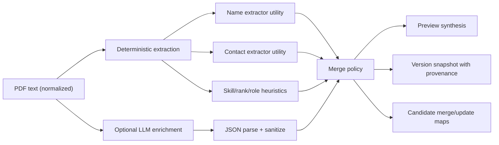

# Candidate Extraction and Profiling

## Pipeline overview

## Deterministic stage

- Name extraction:
  - header-line candidate scoring.
  - role-suffix stripping.
  - latex-like fragmented uppercase repair (e.g. split token joins).
  - fallback chain: header -> email-local-part -> filename.
- Contact extraction:
  - email regex.
  - phone sanitization with extension removal and normalized E.164-ish output.
  - LinkedIn/GitHub host-targeted URL extraction.
  - Portfolio URL extraction excluding known social hosts.
- Skills and role signals:
  - known-skill occurrence counting.
  - significant skill ranking.
  - role suggestions with signal thresholds and seniority labeling.

## Hybrid enrichment stage

- Gate:
  - active only when `app.ingest.llm-enrichment.enabled=true`.
- Contract:
  - strict JSON response required from model.
- Merge strategy:
  - name replacement only when deterministic name is weak and LLM name passes plausibility checks.
  - skills/significant skills/suggested roles merged with deterministic lists.
  - years/location refined under confidence/guard constraints.
  - summary appended into preview section.

## Candidate identity and deduplication

- Candidate ID seed precedence:
  - email > linkedin > github > portfolio > phone > display name > source filename.
- Content-hash dedup:
  - prevents duplicate embedding for equal resume content.
  - duplicate file is merged into existing candidate profile source list/version history.

## Versioned provenance model

`CandidateProfileVersion` stores:

- source metadata:
  - `sourceFilename`, `ingestedAt`, `normalizedContentHash`, `normalizedTextChars`.
- extraction outputs:
  - skills/significant skills/suggested roles/years/location/preview.
- provenance and quality:
  - `extractionMethod` (`rules-only`, `hybrid-llm-rules`, `rules-fallback`).
  - `fieldConfidence` map.
  - `fieldEvidence` map.
  - `validationWarnings` list.

## Quality controls and warnings

- Deterministic warnings include:
  - low-confidence or missing name.
  - missing direct contact channel.
  - empty skills/significant skills/role alignment.
- LLM fallback warning is attached when enrichment fails after being attempted.

## UI exposure

- Candidate Details modal exposes:
  - extraction method.
  - top field confidence tags.
  - validation warnings.
  - source hash/normalized char count.
