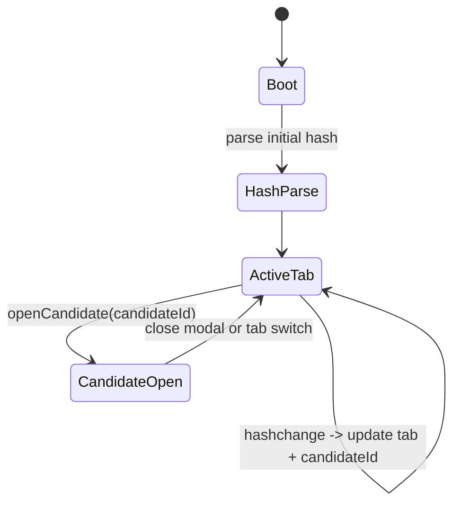
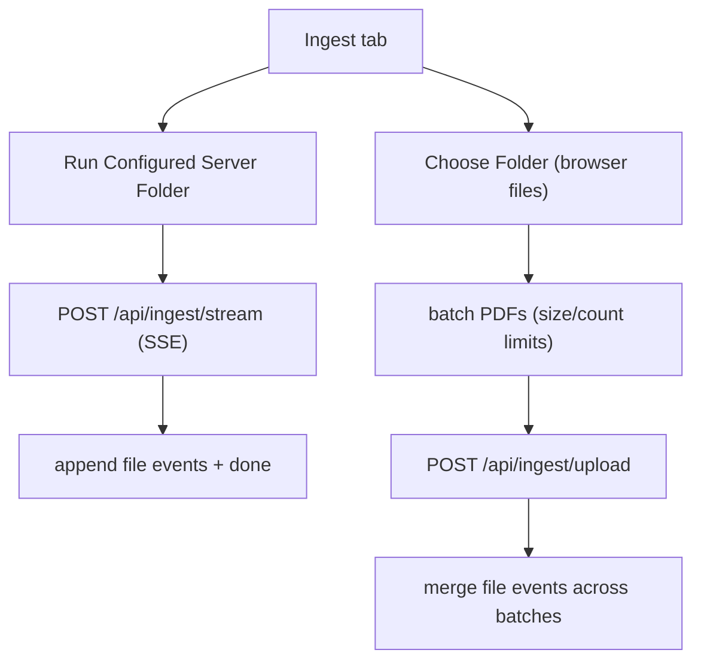

# Frontend Routing and Runtime State

## Route model

The frontend uses hash-based routing with a tab-key contract.

Supported tabs:

- `ingest`
- `chat`
- `query`
- `match`
- `candidates`
- `compare`
- `audit`
- `eval`

Route forms:

- `#/chat`
- `#/query`
- `#/candidates`
- `#/candidates?candidate=<id>`

## Navigation state machine

## Candidate refresh policy

- Candidate list refresh is event-driven only:
  - when Candidates tab becomes active.
  - when page/pageSize/sort changes while tab is active.
  - when user clicks explicit Refresh.
- Search/skill text changes alone do not auto-fetch; they apply when user presses `Find`.
- Periodic polling is intentionally disabled for `/api/candidates`.

## Ingest UI execution modes

## Candidate modal opening paths

- Query page:
  - source row "Candidate" button opens profile via hash route to `#/candidates?candidate=<id>`.
- Candidates page:
  - table row action opens profile and lazy-loads full candidate payload.
  - hash route `#/candidates?candidate=<id>` opens the profile modal directly.
- Compare page:
  - candidate selectors fetch full profile snapshots for side-by-side rendering.
