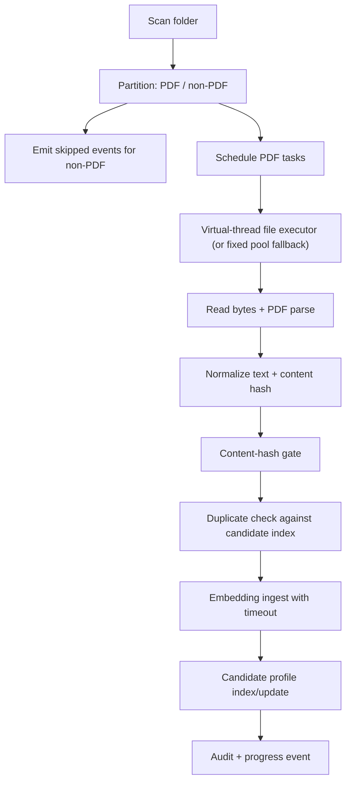
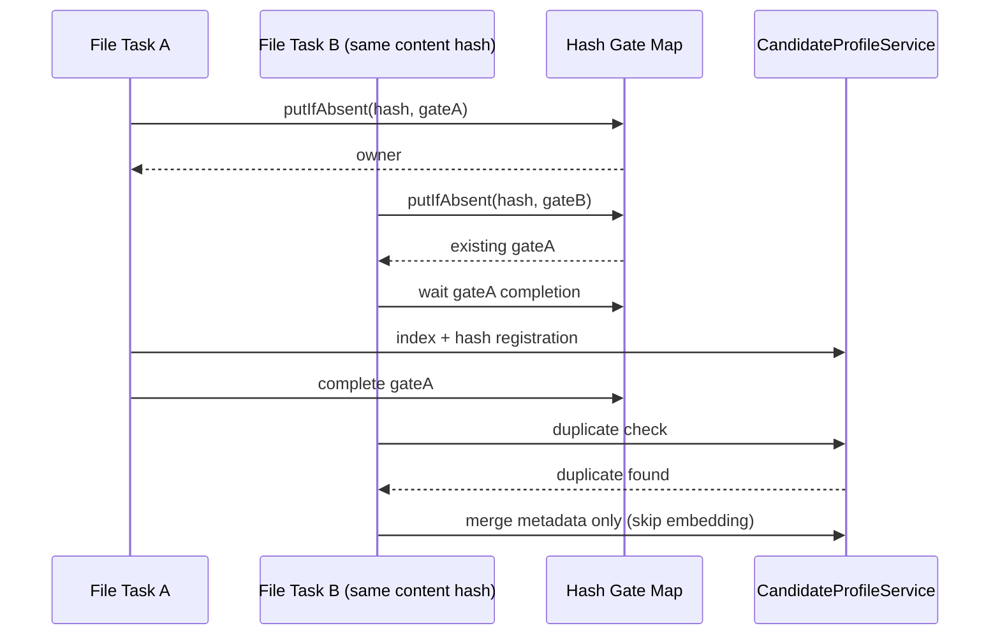

# Ingestion Engine (Virtual Threads)

## Objectives

- Ingest resume PDFs from server folder or multipart upload.
- Reject non-PDF files early with deterministic reason codes.
- Avoid duplicate embedding for equal content hashes.
- Support background jobs and streaming progress.
- Bound embedding latency with per-file timeout.

## Endpoints and execution modes

| Endpoint | Mode | Response model |
|---|---|---|
| `POST /api/ingest` | synchronous folder run | aggregate count |
| `POST /api/ingest/stream` | synchronous folder run with SSE | file-level events + done |
| `POST /api/ingest/upload` | synchronous uploaded files | aggregate + file events |
| `POST /api/ingest/jobs/folder` | async job launcher | job snapshot |
| `POST /api/ingest/jobs` | async default job launcher (alias) | job snapshot |
| `GET /api/ingest/jobs` | job monitor | job list |
| `GET /api/ingest/jobs/{id}` | async job monitor | single job snapshot |

## Folder ingest concurrency model

## Duplicate coordination behavior

## Timeout and failure semantics

- `app.ingest.file-timeout-seconds` applies to embedding operation per file.
- Timeout outcome:
  - file marked `skipped`.
  - audit event persisted with timeout reason.
  - ingest continues with remaining files.
- Read/parse failures:
  - deterministic skip event and run-level skipped increment.

## Background job state consistency

- `IngestJobService` keeps mutable job state synchronized for:
  - status transitions (`queued -> running -> completed|failed`).
  - counters (`processed`, `skipped`) and user-visible `message`.
  - atomic snapshot reads used by `/api/ingest/jobs` and `/api/ingest/jobs/{id}`.
- Terminal transitions are emitted with coherent snapshot content so polling clients do not observe partial terminal states.

## Virtual thread controls

| Property | Default | Effect |
|---|---:|---|
| `app.ingest.virtual-threads-enabled` | `true` | Use `newVirtualThreadPerTaskExecutor()` for ingest workers |
| `app.ingest.concurrent-files` | `4` | Max folder files processed in parallel |

## Observability and audit integration

- At run completion:
  - `IngestAuditService.saveRun(processed, skipped)`
  - `ObservabilityService.recordIngestRun(processed, skipped)`
- Candidate extraction stage emits extraction counters separately.
