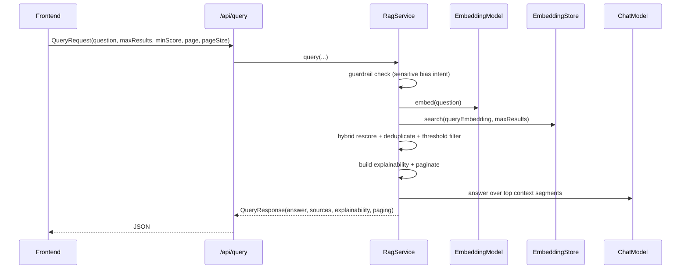

# Retrieval, Ranking, and Query Explainability

## Query lifecycle

## Ranking model

Hybrid score per segment:

- `hybrid = clamp(vector_score * 0.8 + keyword_overlap_score * 0.2)`

Where:

- `vector_score` is returned by embedding similarity search.
- `keyword_overlap_score` is matched query terms ratio over normalized text.

## Result shaping

- Deduplication key policy:
  - primary: source filename.
  - fallback: normalized segment text.
- Context limit for answer synthesis:
  - top `MAX_CONTEXT_SEGMENTS` matches.
- Pagination:
  - applied after ranking and deduplication.
  - response includes `page`, `pageSize`, `totalSources`.

## Explainability payload

- `matchedTerms`: top matched normalized query terms.
- `missingTerms`: terms not matched in retrieved segments.
- `confidenceScore`: average hybrid score of top matches (clamped [0,1]).

## Safety/guardrail path

- Disallowed pattern:
  - request combines protected-attribute terms with ranking/filter intent.
- Behavior:
  - no retrieval execution.
  - structured policy answer returned.
  - no sources emitted.

## Feedback loop

- Optional score tuning:
  - request flag can apply recommendation from feedback service.
- Feedback endpoint stats inform:
  - recommended min-score baseline.
  - helpful-rate and quality trend tracking.
